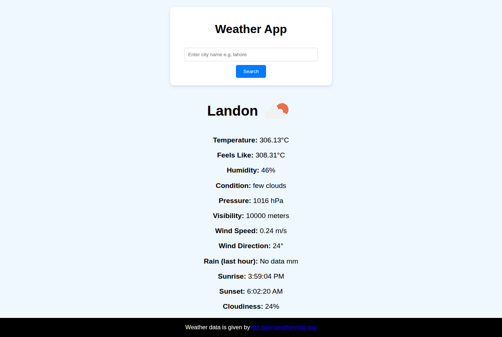

Weather App

A responsive weather application that allows users to search for real-time weather data by entering a city name. This project utilizes JavaScript, HTML, CSS, and AJAX to fetch weather data from the [OpenWeatherMap API](https://openweathermap.org/).

Screenshot



Features
- 🔍 Search for any city to get current weather details.
- 🌡️ Displays temperature, humidity, pressure, visibility, wind speed & direction.
- ☁️ Shows current weather condition and cloudiness.
- 🌅 Sunrise and sunset times based on the queried city.
- 📡 Utilizes AJAX for smooth and asynchronous data retrieval.

Technologies Used

- HTML5 & CSS3
- JavaScript (Vanilla JS)
- AJAX (Asynchronous JavaScript and XML)
- OpenWeatherMap API

Setup Instructions

1. **Clone the repository:**
   ```bash
   git clone https://github.com/your-username/weather-app.git
